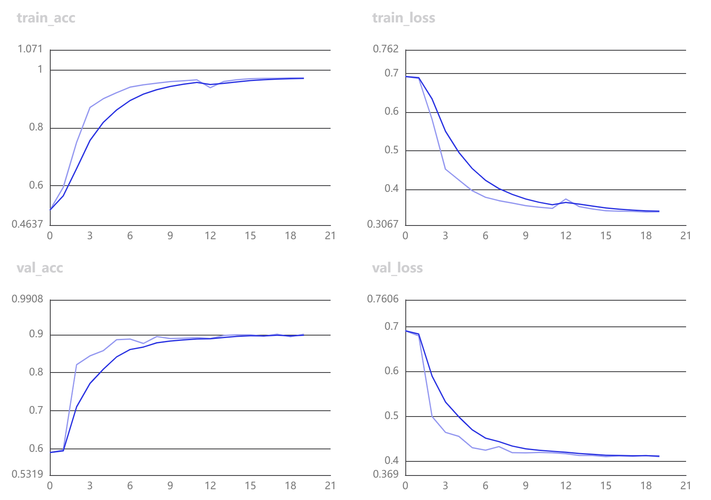

## Chinese-Text-Classification-Paddle
### 1. 项目描述
通过`Paddle`利用传统`RNN`实现中文文本分类任务
- [Convolutional Neural Networks for Sentence Classification](https://arxiv.org/pdf/1408.5882)
- [Recurrent Convolutional Neural Networks for Text Classification](https://www.aaai.org/ocs/index.php/AAAI/AAAI15/paper/download/9745/9552)
- [Attention-Based Bidirectional Long Short-Term Memory Networks for Relation Classification](https://aclanthology.org/P16-2034.pdf)
- [Hierarchical Attention Networks for Document Classification](https://aclanthology.org/N16-1174.pdf)

### 2. 代码结构
```angular2html
|--models
|   |--TextCNN.py: Convolutional Neural Networks for Sentence Classification代码实现
|   |--TextRNN.py：Recurrent Convolutional Neural Networks for Text Classification代码实现
|   |--TextBiLSTM_Att.py：Attention-Based Bidirectional Long Short-Term Memory Networks for Relation Classification和Hierarchical Attention Networks for Document Classification代码实现
|--utils
|   |--dataset_utils.py：数据处理配置文件
|   |--train_val_utils.py：训练和验证配置文件
|--train.py：训练脚本
|--predict.py：预测脚本
|--README.md：文档说明
```
### 3. 数据集
[ChnSentiCorp](https://github.com/SophonPlus/ChineseNlpCorpus/blob/master/datasets/ChnSentiCorp_htl_all/intro.ipynb) 中文评论情感分析语料：包含7000多条酒店评论数据，5000 多条正向评论，2000 多条负向评论

### 4. 环境配置
```angular2html
paddlepaddle==2.3.0rc0
paddlenlp==2.2.6
numpy==1.21.5
visualdl==2.2.3
```

### 5. 训练效果展示


### 6. 模型对比展示
|模型|Acc|备注|参考论文|
|----|----|----|----|
|TextCNN|0.9031|CNN|[Convolutional Neural Networks for Sentence Classification](https://arxiv.org/pdf/1408.5882)|
|TextRNN|0.9013|BiLSTM|[Recurrent Convolutional Neural Networks for Text Classification](https://www.aaai.org/ocs/index.php/AAAI/AAAI15/paper/download/9745/9552)|
|TextBiLSTM_Att|0.9047|BiLSTM+Attention|[Attention-Based Bidirectional Long Short-Term Memory Networks for Relation Classification](https://aclanthology.org/P16-2034.pdf)|
|TextBiLSTM_Att|0.8984|BiLSTM+Attention|[Hierarchical Attention Networks for Document Classification](https://aclanthology.org/N16-1174.pdf)|

### 7. 使用说明
```angular2html
# 训练
# TextCNN
python train.py --network textcnn

# TextRNN
python train.py --network textrnn

# TextBiLSTM_Attention
python train.py --network textbilstm_att

# TextBiLSTM_Interactive_Attention
python train.py --network textbilstm_inter_att

# 测试
python predict.py
```

### 8. 测试效果展示
```angular2html
Data: 这个宾馆比较陈旧了，特价的房间也很一般。总体来说一般 	 Label: negative
Data: 怀着十分激动的心情放映，可是看着看着发现，在放映完毕后，出现一集米老鼠的动画片！
      开始还怀疑是不是赠送的个别现象，可是后来发现每张DVD后面都有！真不知道生产商怎么想的，
      我想看的是猫和老鼠，不是米老鼠！如果厂家是想赠送的话，那就全套米老鼠和唐老鸭都赠送，
      只在每张DVD后面添加一集算什么？？简直是画蛇添足！！ 	 Label: negative
Data: 还稍微重了点，可能是硬盘大的原故，还要再轻半斤就好了。其他要进一步验证。
      贴的几种膜气泡较多，用不了多久就要更换了，屏幕膜稍好点，但比没有要强多了。
      建议配赠几张膜让用用户自己贴。 	 Label: negative
Data: 交通方便；环境很好；服务态度很好 房间较小 	 Label: positive
Data: 不错，作者的观点很颠覆目前中国父母的教育方式，其实古人们对于教育已经有了很系统的体系了，
      可是现在的父母以及祖父母们更多的娇惯纵容孩子，放眼看去自私的孩子是大多数，
      父母觉得自己的孩子在外面只要不吃亏就是好事，完全把古人几千年总结的教育古训抛在的九霄云外。
      所以推荐准妈妈们可以在等待宝宝降临的时候，好好学习一下，怎么把孩子教育成一个有爱心、
      有责任心、宽容、大度的人。 	 Label: positive

```